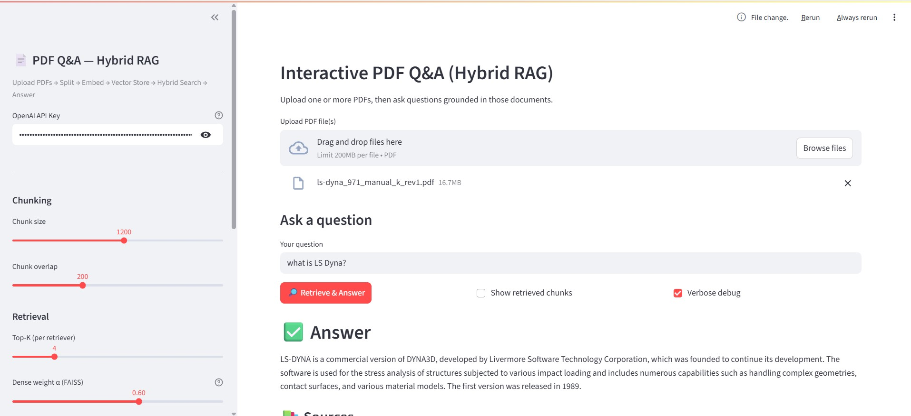

# 📄 PDF Q&A — Hybrid RAG (Streamlit + LangChain + FAISS)

An interactive, production-grade **PDF question–answering** app built with **Streamlit**, **LangChain**, and a **hybrid retriever** (BM25 + FAISS).  
Upload one or multiple PDFs, control chunking, temperature, and retrieval behavior, and get **grounded answers with sources**.  
Indexes are **persisted on disk** so you don’t re-embed your corpus every run.

---
## 🖼️ Demo Screenshot




## ✨ Features

- **Multi-PDF upload** (drag & drop)
- **Modular pipeline**: ingest → split → embed → vector store → hybrid retrieval → answer
- **Hybrid search**: BM25 (keywords) + FAISS (dense vectors) via reciprocal-rank fusion
- **Full user controls**:
  - OpenAI API key (entered at runtime)
  - Chunk size & overlap
  - Top‑K per retriever
  - Dense weight **α** (0 → keyword-only, 1 → dense-only)
  - LLM model & temperature
  - Embedding model (OpenAI)
- **Persistent FAISS index** on disk (no re-embedding on subsequent runs)
- **Source previews**: expand to view retrieved chunks and the exact pages used
- **Debug options**: show full retrieved context and raw chain response

---

## 🧱 Architecture

```
Uploads → Ingest (PyPDFLoader) → Split (RecursiveCharacterTextSplitter)
→ Embeddings (OpenAI) → FAISS index (persisted to disk)
→ Hybrid Retriever (BM25 + FAISS) → LLM (ChatOpenAI) → Answer + Sources
```

- Indexes are saved under `indexes/<corpus_sha1_prefix>/` with a guard `meta.json` (embed model + split params).
- On subsequent runs with the **same corpus + params**, the app **loads** the FAISS index instead of rebuilding.

---

## 📁 Project Structure

```
.
├── app.py               # Streamlit UI (controls, upload, build index, ask)
├── rag_utils.py         # RAG helpers (ingest, split, persist FAISS, hybrid retriever, QA chain)
├── requirements.txt     # Python dependencies
└── README.md            # This file
```

---

## 🔧 Requirements

- Python **3.10+** recommended
- An OpenAI API key with access to the selected chat & embedding models

Install deps:

```bash
pip install -r requirements.txt
```

> On Apple Silicon/Windows, `faiss-cpu` from `pip` works for most cases. If you hit FAISS install issues, check the FAISS wheel for your platform or consider using a Conda environment.

---

## 🚀 Run Locally

**Windows / macOS / Linux** (inside your virtual environment):

```bash
streamlit run app.py
# or if streamlit isn't on PATH:
python -m streamlit run app.py
```

Then open the URL Streamlit prints (e.g., `http://localhost:8501`).

### First Use (Interactive Flow)

1. **Enter your OpenAI API key** in the sidebar.
2. **Upload** one or more PDF files.
3. Set **chunk size** / **overlap**, retrieval **Top‑K**, and **α** (dense weight).
4. Click **“Build / Load Index”** to split, embed, and persist the FAISS index.
5. Ask questions in the input box and review answers & **sources**.

> The index is reused when the **corpus and parameters** (embed model, chunk size, overlap) match. Changing them will trigger a rebuild.

---

## ⚙️ Configuration Details

### Chunking
- Sensible defaults: `chunk_size=1200`, `chunk_overlap=200`
- For front-matter facts (DOI, author email), smaller chunks can help: e.g. `600 / 100`

### Hybrid Retrieval
- **α** controls BM25 vs dense weighting:
  - α = **0.4** → keyword‑leaning (good for exact strings like “DOI”)
  - α = **0.7** → semantic‑leaning (good for conceptual questions)

### Embeddings & Models
- Embeddings: `text-embedding-3-small` (fast & affordable) or `-large` (higher quality)
- Chat models: `gpt-4o-mini` (default), `gpt-4o`, etc.
- Temperature: typically **0.0** for QA; increase for more creative synthesis.

### Index Persistence
- Index path: `indexes/<corpus_sha1_prefix>/`
- Guarded by `meta.json` (embed model + chunking params).  
- To force rebuild, delete the folder or change params.

---

## 🧪 Example Commands

```bash
# Install & run
python -m venv .venv && source .venv/bin/activate  # (Windows: .venv\Scripts\activate)
pip install -r requirements.txt
streamlit run app.py

# Choose port
streamlit run app.py --server.port 8502
```
